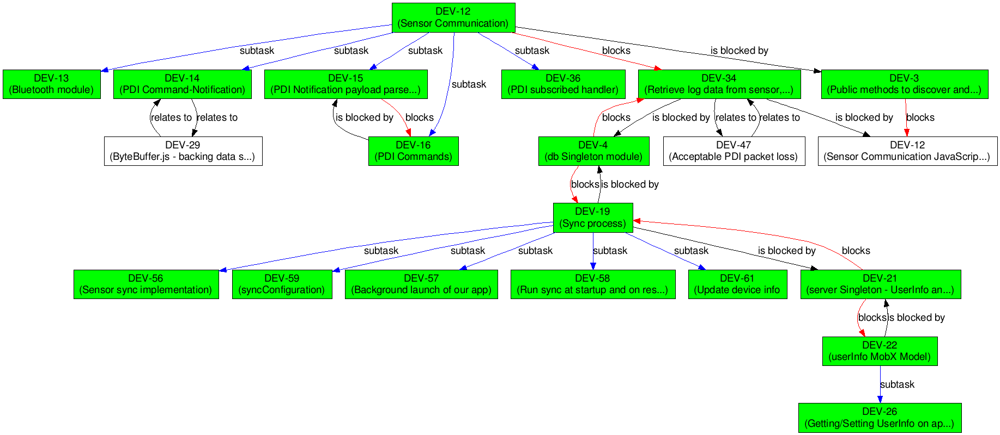

jira-dependency-graph
=====================

Graph visualizer for dependencies between JIRA tickets. Takes into account subtasks and issue links.

Uses JIRA rest API v2 for fetching information on issues.
Uses [Google Chart API](https://developers.google.com/chart/) for graphical presentation.

Example output
==============



Requirements:
=============
* Python 2.7+ or Python 3+
* [requests](http://docs.python-requests.org/en/master/)

Or
* [docker](https://docs.docker.com/install/)

Usage:
======
```bash
$ git clone https://github.com/pawelrychlik/jira-dependency-graph.git
$ virtualenv .virtualenv && source .virtualenv/bin/activate # OPTIONAL
$ cd jira-dependency-graph
$ pip install -r requirements.txt
$ python jira-dependency-graph.py --user=your-jira-username --password=your-jira-password --jira=url-of-your-jira-site issue-key
```

Or if you prefer running in docker:
```bash
$ git clone https://github.com/pawelrychlik/jira-dependency-graph.git
$ cd jira-dependency-graph
$ docker build -t jira .
$ docker run -v $PWD/out:/out jira python jira-dependency-graph.py --user=your-jira-username --password=your-jira-password --jira=url-of-your-jira-site --file=/out/output.png issue-key
```

```
# e.g.:
$ python jira-dependency-graph.py --user=pawelrychlik --password=s3cr3t --jira=https://your-company.jira.com JIRATICKET-718

Fetching JIRATICKET-2451
JIRATICKET-2451 <= is blocked by <= JIRATICKET-3853
JIRATICKET-2451 <= is blocked by <= JIRATICKET-3968
JIRATICKET-2451 <= is blocked by <= JIRATICKET-3126
JIRATICKET-2451 <= is blocked by <= JIRATICKET-2977
Fetching JIRATICKET-3853
JIRATICKET-3853 => blocks => JIRATICKET-2451
JIRATICKET-3853 <= relates to <= JIRATICKET-3968
Fetching JIRATICKET-3968
JIRATICKET-3968 => blocks => JIRATICKET-2451
JIRATICKET-3968 => relates to => JIRATICKET-3853
Fetching JIRATICKET-3126
JIRATICKET-3126 => blocks => JIRATICKET-2451
JIRATICKET-3126 => testing discovered => JIRATICKET-3571
Fetching JIRATICKET-3571
JIRATICKET-3571 <= discovered while testing <= JIRATICKET-3126
Fetching JIRATICKET-2977
JIRATICKET-2977 => blocks => JIRATICKET-2451

Writing to issue_graph.png
```
Result:


Advanced Usage:
===============

List of all configuration options with descriptions:

```
python jira-dependency-graph.py --help
```

### Excluding Links

In case you have specific issue links you don't want to see in your graph, you can exclude them:

```bash
$ python jira-dependency-graph.py --user=your-jira-username --password=your-jira-password --jira=url-of-your-jira-site --exclude-link 'is required by' --exclude-link 'duplicates' issue-key
```

The grapher will still walk the link, just exclude the edge. This especially useful for bidirectional links and you only
want to see one of them, e.g. *depends on* and *is required by*.

### Excluding Epics

In case you want to exclude walking into issues of an Epic, you can ignore them:

```bash
$ python jira-dependency-graph.py --user=your-jira-username --password=your-jira-password --jira=url-of-your-jira-site --ignore-epic issue-key
```

### Including Issues

In order to only specify issues with a certain prefix pass in `--issue-include <XXX>` and all tickets will be checked that they match the prefix `XXX`.

### Excluding Issues

By passing in `--issue-exclude`, or `-xi` the system will explicitly ignore the ticket. It can be repeated multiple times, e.g. `-xi MYPR-456 -x MYPR-999` to ignore both issues. 
Use it as a last-resort only, when other means of exclusion do not suit your case, e.g. to omit a part of the graph for better readability.

### Authentication

It is possible to either use the username/password combination or to login via the browser passing in `--cookie <JSESSIONID>`. This logins via the browser and is useful in scenarios where Kerberos authentication is required.

If you are using Atlassian Cloud, use your API token instead of your account password. You can generate one with the following steps:

1. Access https://id.atlassian.com/manage-profile/security/api-tokens.
2. Click "Create API token".
3. Copy the token and store it in a safe place.

More details about API authentication is available in the [official documentation](https://developer.atlassian.com/cloud/jira/platform/basic-auth-for-rest-apis/).

### Closed Issues

By passing in `--ignore-closed` the system will ignore any ticket that is closed.

### Multiple Issues

Multiple issue-keys can be passed in via space separated format e.g.
```bash
$ python jira-dependency-graph.py --cookie <JSESSIONID> issue-key1 issue-key2
```

### JQL Query

Instead of passing issue-keys, a Jira Query Language command can be passed with `--jql` e.g.
```bash
$ python jira-dependency-graph.py --cookie <JSESSIONID> --jql 'project = JRADEV'
```


Usage without Google Graphviz API:
============
If you have issues with the Google Graphviz API limitations you can use your local graphviz installation like this:

```bash
$ git clone https://github.com/pawelrychlik/jira-dependency-graph.git
$ cd jira-dependency-graph
$ python jira-dependency-graph.py --user=your-jira-username --password=your-jira-password --jira=url-of-your-jira-site --local issue-key | dot -Tpng > issue_graph.png
```

*Note*: Its possible that the graph produced is too wide if you have a number of issues. In this case, it is better to firstly pipe the graph to a 'dot' text file e.g.

```bash
$ python jira-dependency-graph.py --jira=url-of-your-jira-site --local issue-key > graph.dot
```

and then process it using `unflatten`:

```bash
unflatten -f -l 4 -c 16 graph.dot  | dot | gvpack -array_t6 | neato -s -n2 -Tpng -o graph.png
```

For a slightly cleaner layout (that preserves the ranks), or if your system doesn't have `unflatten`, you can use `sed` to insert `rankdir=LR;` into the dot file before processing it:
```bash
sed -i 's/digraph{/digraph{ rankdir=LR;/g' graph.dot | dot -o graph.png -Tpng
```

Notes:
======
Based on: [draw-chart.py](https://developer.atlassian.com/download/attachments/4227078/draw-chart.py) and [Atlassian JIRA development documentation](https://developer.atlassian.com/display/JIRADEV/JIRA+REST+API+Version+2+Tutorial#JIRARESTAPIVersion2Tutorial-Example#1:GraphingImageLinks), which seemingly was no longer compatible with JIRA REST API Version 2.


Apologies and Messy Changes (gfaza customizations WIP):
======
These hasty and large commits for the sake of sharing quickly, are less than congenial.  I'd love to come back and clean both the code and the comments, especially since there are other tweaks to come.

**Please Note:** Backward compatibility with the above hasn't been asserted.

**FWIW:** These changes were developed and utilized with the following suggested runtime options:
```bash
-show-directions=outward --word-wrap --include-state --include-labels
```

Things included in these changes:

1. Getting started, you'll need to create then update `personal-config.ini` with your Jira credentials.  **BEWARE**: do not commit this file, so you don't accidentally share your creds!  Additionally, you'll likely enjoy updating the domain-specific configuration template in order to stylize your output.
    ```bash
    > ./initialize-organization-configuration.sh
    ```
    or in case that fails, the following:
    ```bash
    > mkdir ./config
    > echo "[EXAMPLE]\nJIRA_HOST = https://example.atlassian.net\nJIRA_USER = alice@example.com\nJIRA_PASS = # Create an API key at https://id.atlassian.com/manage-profile/security/api-tokens\n\n" > ./config/personal-config.ini
    > echo "### define the color scheme and state color progression to use. ###\ncolor-setting:\n  color-scheme: ylgn9\n  fill-colors: [ 1, 2, 3, 4, 5, 6, 7, 8, 9 ]\n  font-colors: [None, None, None, None, None, None, white, white, white ]\n### define any graph attributes particular to specific node types ###\nnodes:\n  - name: [ epic ]\n    node-options:\n      shape: cylinder\n      labelloc: b\n    edge-options:\n      color: orange\n  - name: [ label ]\n    node-options:\n      shape: cds\n    edge-options:\n      color: grey85\n### define any graph attributes particular to specific edge types ###\nedges:\n  - name: [ epic ]\n    edge-options:\n      color: orange\n  - name: [ subtask ]\n    edge-options:\n      color: blue\n      label: subtask\n  - name: [ block ]\n    edge-options:\n      color: red\n### define the issue states to be colored according to the custom color scheme progression.  any omitted will show according to the status category: yellow ('In Progress'), green ('Complete'), else (no color/white) ###\nworkflows:\n  - issue-types: [ epic ]\n    states:\n      # - backlog\n      - in progress\n      - completed\n  - issue-types: [ story, bug ]\n    states:\n      # - backlog\n      # - ready for development\n      - in development\n      - ready for testing\n      - in testing\n      - ready for release\n      - released\n### consolidate groups of labels to a single alias ###\nlabels:\n  - name: Defect\n    group: [ defect, bug, staging-bug, production-bug ]\n  - name: Research & Development\n    group: [ spike, arch, architecture, research, r&d ]\n  ### labels to omit from diagrams ###\n  - ignore: [ documentation, testing, tech-debt ]\n" > ./config/example-config.yml
    ```

3. For access to multiple organizations, add those additional creds in `personal-config.ini` then specify on the command line with the `--org` option.  The script will default to the first `[SECTION]` it finds in your `personal-config.ini`, unless `--org` is specified.
    ```bash
    --org=SOME_ADDITIONAL_ORGANIZATION_I_BELONG_TO
    ```

4. If you are aiming to use the docker version, you'll need to build the docker image.  This is recommended if you're concerned about ruining your local Python environment or hesitant about installing Graphviz on your local machine.
    ```bash
    > docker build -t jira .
    ```

5. When using the config directory, you'll need to add the share to that directory by adding the following to your command:
    ```bash
    $PWD/config:/config
    ```

6. If you prefer to use your own installation of Graphviz, you can pipe the output of using `--local` to it, such as
    ```bash
    > docker run -v $PWD/config:/config -v $PWD/out:/out jira python jira-dependency-graph.py --local STORY-123 | dot -Tpng > ~/Desktop/STORY-123-graph.png
    ```

7. The non-`--local` version seemed broken since google isn't handling that endpoint anymore, so Graphviz is now included in the docker image.  i.e., we're no longer required to use --local then pipe to dot (Graphviz) on your host machine.
    ```bash
    > docker run -v $PWD/config:/config -v $PWD/out:/out jira python jira-dependency-graph.py STORY-123
    ```

8. An additional artifact when this script is executed without `--local`, will be a PDF version of the diagram, where each node on the diagram hyperlinks you to its corresponding card on Jira


8. New command line option: To automatically update a card with your diagram, specify a destination card.  This destination can be any card, whether or not it's related to the diagram.  The card specified will receive attachments of the PNG and PDF graphs, and will have it's description updated to include the graph as an embedded image:
    ```bash
    --issue-update=<jira-card-key>
    ```

9. New command line options: Include additional issue elements on your node's label:
    ```bash
    --include-state
    --include-assignee
    ```

10. New command line option: Include issue labels as additional nodes on the graph.  Can be a useful way of further helping the layout algorithm:
    ```bash
    --include-labels
    ```

11. New command line option: Include the script command line arguments as the title of your graph:
    ```bash
    --include-arguments
    ```

12. New command line option: Limit the depth of issues visited, from the issues searched:
    ```bash
    --depth-limit=<some-int>
    ```

13. New command line option: Direction in which sequential nodes will be rendered, with a default of "TB" (Top to Bottom).
    ```bash
    --graph-rank-direction=<TB|LR|BT|RL>
    ```

14. Graph configuration yaml:  A default yaml will be generated along with the `personal-config.ini`, as a template for customizing the color scheme and other elements of the graphs.  be sure to keep the org name in sync with your `personal-config.ini`.  e.g., if your `personal-config.ini` section reads `[EXAMPLE]`, then the corresponding yaml file must be named `example-config.yml`.
    1. ***color-setting:*** The name of the Graphviz color scheme to use (https://graphviz.org/doc/info/colors.html), and the ordered list of colors to use when rendering issues, as they progress through their given workflow.
       1. e.g., `color-setting: { color-scheme: set16, fill-colors: [1, 5, 6, 3, 2, 4] }` would produce graphs in (close to) pride colors.
    2. ***nodes:*** Customizations for rendering Epics and Labels (optionally included in diagrams).
    3. ***edges:*** Customizations for rendering edges related to Epic, Subtask, and Blocking issues.
    4. ***workflows:*** Definitions for your organization's issue types, and the ordered statuses for their respective workflows.
    5. ***labels:*** A means of consolidating similar labels to simplify graphing, as well as a means of ignoring/omitting certain labels from appearing.
    6. Executing the command for a value of `color-demo` in place of an issue key will produce a partial preview of the graph configuration.
       ```bash
       > docker run -v $PWD/config:/config -v $PWD/out:/out jira python jira-dependency-graph.py color-demo
       ```


Wishlist/Planned changes:
======
* Verify backward and forward compatibility, in both docker and non-docker operation (i.e., ensure enhancements are strictly optional).
* Update/improve documentation.
* Improve output file naming.
* Investigate whether jira issue description embedded PNG can open PDF attachment on click (i.e., embedding PNG to serve as thumbnail href to the PDF).
* Investigate automating updates to a specified confluence page, similar to how this automates updates to jira issues. 
* Investigate automatically opening the graph on the local machine after rendering.
* Consider prevent issues from being missed only because the story leading to them is ignored (distinguish ignore vs traverse).
* Develop further flexibility via the configuration yaml.
* Revisit dependencies, and whether they can be reduced/simplified.
